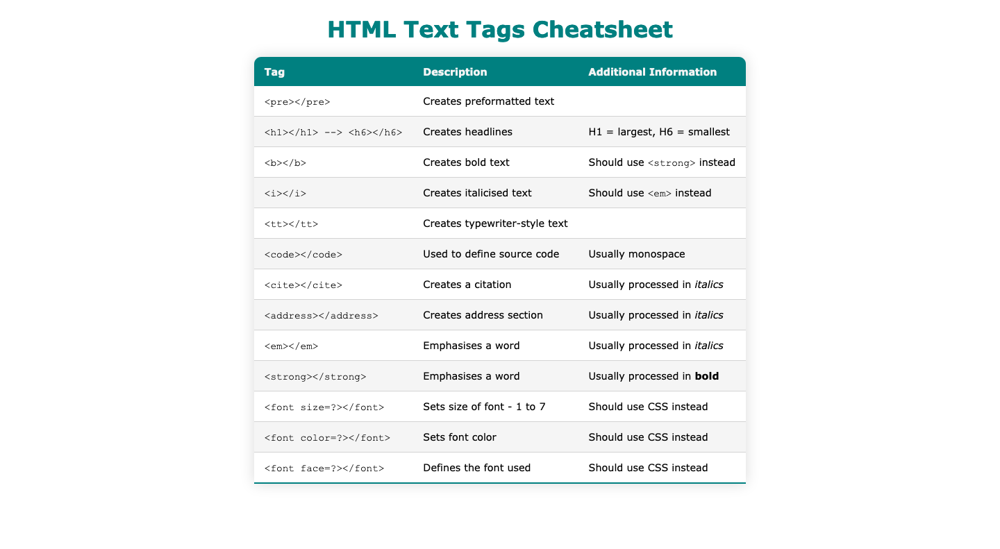

# CodeCademy Challenge Project: Build Your Own Cheat Sheet

This is my solution to the Build Your Own Cheat Sheet challenge in CodeCademy's Web Development Fundamentals Course

## Table of contents

- [Overview](#overview)
  - [The challenge](#the-challenge)
  - [Screenshot](#screenshot)
  - [Links](#links)
- [My process](#my-process)
  - [What I learned](#what-i-learned)
  - [Continued development](#continued-development)
  - [Useful resources](#useful-resources)
- [Author](#author)
- [Acknowledgments](#acknowledgments)

## Overview

### The challenge

"Project Goals

In this project, you’ll be building your own reference cheat sheet to help you build more websites in the future! Although there are great places to learn HTML & CSS like Codecademy, the best reference for yourself is often your own notes and projects."

-CodeCademy

### Screenshot

### Links

- Solution URL: [Add solution URL here](https://your-solution-url.com)
- Live Site URL: [Add live site URL here](https://your-live-site-url.com)

## My process

### What I learned

This is my first time creating a table. I learned how to add a drop shadow and how to target every other row using tr:nth-last-of-type(even).

### Continued development

I need to learn more about overflow: hidden; and also specificity as I had to add an !important tag to get my hover to work on the rows which had a background colour.

### Useful resources

- [Example resource 1](https://web.stanford.edu/group/csp/cs21/htmlcheatsheet.pdf) - I used this Cheatsheet as a reference. 
- [Example resource 2](https://dev.to/dcodeyt/creating-beautiful-html-tables-with-css-428l) - I used this tutorial to learn how to style a table with CSS.
- [Example resource 3](https://www.textfixer.com/tutorials/highlight-table-row.php) - I used this page to learn how to highlight a row on hover.

**Note: Delete this note and replace the list above with resources that helped you during the challenge. These could come in handy for anyone viewing your solution or for yourself when you look back on this project in the future.**

## Author

- Website - [Add your name here](https://www.your-site.com)

## Acknowledgments

Many thanks to Dcode for the useful tutorial on how to style a table. You can check out Dcode's YouTube channel here: https://www.youtube.com/channel/UCjX0FtIZBBVD3YoCcxnDC4g